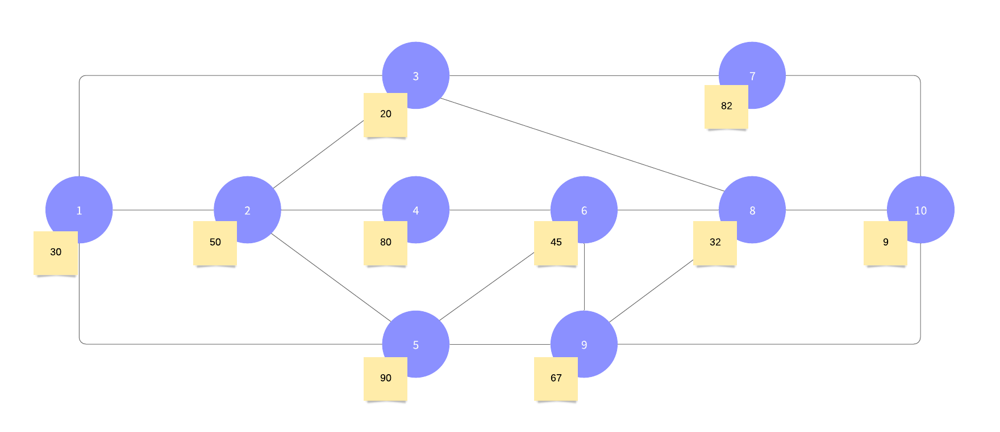

# Bully Algorithm (Leader Election)

This code simulate the an algorithm to elect a leader in a wireless network. To make easier to understand and implement, was created a network topology with ten different process. There is an simple menu to help you see what's happening in some moments of algorithm execution.

## Topology


The blue circles are process and yellow notes its capacity

## Running
Obs: It's necessary to use linux to execture the start script, if you are using other operation sistem you can execute manualy follow this repository other implementations pattern, starting at process id 1 and finish at port 9010 and process id 10 

1. Clone this reposioty and in the root folder execute the following command
```
chmod 777 wireless-leader-election.sh
```

this command give permission to script file execute command in yout computer

2. Run the script to open terminals and run applications simultaneously

```
./wireless-leader-election.sh
```